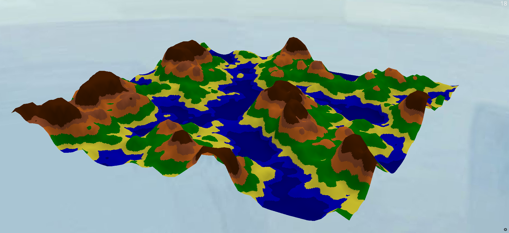

# Procedural Terrain Generation #

Procedurally generate random terrain with **Perlin Noise**.

## Basic Information ##

GitHub repository : [https://github.com/B10732009/procedural-terrain-generation](https://github.com/B10732009/procedural-terrain-generation)

**[Procedural Generation](https://en.wikipedia.org/wiki/Procedural_generation)** is a method of **creating data algorithmically** as opposed to manually, typically through a combination of human-generated assets and algorithms coupled with computer-generated randomness and processing power. 

In video games,  **Procedural Terrain Generation** is very useful where you want to generate natural terrain (caves, hills, rivers, etc.) that has a smooth feel, but is still random.

## Problem to Solve ##

**Perlin Noise** is a very popular algorithm for procedural generation developed by Ken Perlin in 1983. It can be used for any kind of wave-like, undulating material, texture, or terrain. 

Compared with just some random values, Perlin Noise can generate values very smoothly and continuously, which looks more realistic in terrain generation. 

The graph below shows the difference between normal random values and perlin noise.

<p align="center">
    
</p>

In this project, I am going to implement a set of API (for C++ and Python) of the Perlin Noise algorithm in 1D, 2D, and 3D (if time is enough), and use these API to render some terrain with [Ursina](https://www.ursinaengine.org/) (a game engine in Python).

## Prospective Users ##

Anyone who wants to simulate random terrain or uses Perlin Noise for application.

## System Architecture ##

- Use `C++` to implement the algorithm.
- Use `Pybind11` to wrap C++ functions for Python.
- Use `Python` to render the terrain with these APIs (with [Ursina](https://www.ursinaengine.org/)).

<p align="center">
    
</p>

## API Description ##

The API will have both `C++` and `Python` version.

For `Python` users :
```py
import noise

# create class object
n = noise.Noise1D(seed, x_size)
n = noise.Noise2D(seed, x_size, y_size)
n = noise.Noise3D(seed, x_size, y_size, z_size)

# create class object with optional parameters
n = Noise1D(seed, x_size, scale, octaves, lacunarity, persistance)
n = Noise2D(seed, x_size, y_size, scale, octaves, lacunarity, persistance)
n = Noise2D(seed, x_size, y_size, z_size, scale, octaves, lacunarity, persistance)

# get noise at specific position
n[i]        # 1D
n[i, j]     # 2D
n[i, j, k]  # 3D

# get other attributes
n.seed
n.xsz
n.ysz           # (only for 2D & 3D)
n.zsz           # (only for 3D)
n.scale
n.octaves
n.lacunarity
n.persistance
n.data          # get noise list
```

For `C++` users :
```cpp
#include "noise1d.hpp"
#include "noise2d.hpp"
#include "noise3d.hpp"

// create class object
Noise1D n(std::size_t _seed, std::size_t _xsz);
Noise2D n(std::size_t _seed, std::size_t _xsz, std::size_t _ysz);
Noise3D n(std::size_t _seed, std::size_t _xsz, std::size_t _ysz, std::size_t _zsz);

// create class object with optional parameters
Noise1D n(std::size_t _seed, std::size_t _xsz, 
        std::size_t _scale, std::size_t _octaves, double _lacunarity, double _persistance);
Noise2D n(std::size_t _seed, std::size_t _xsz, std::size_t _ysz, 
        std::size_t _scale, std::size_t _octaves, double _lacunarity, double _persistance);
Noise3D n(std::size_t _seed, std::size_t _xsz, std::size_t _ysz, std::size_t _zsz, 
        std::size_t _scale, std::size_t _octaves, double _lacunarity, double _persistance);

// get noise at specific position
n(std::size_t idx1);                                        // 1D
n(std::size_t idx1, std::size_t idx2);                      // 2D
n(std::size_t idx1, std::size_t idx2, std::size_t idx3);    // 3D

// get other attributes
std::size_t seed();
std::size_t xsz();
std::size_t ysz();          // (only for 2D & 3D)
std::size_t zsz();          // (only for 3D)
std::size_t scale();
std::size_t octaves();
double lacunarity();
double persistance();
std::vector<double> data(); // get noise list
```

## Build System ##

This system is built by `makefile`.

Makefile targets :
<table>
    <tr>
        <th>Target</th>
        <th>Description</th>
    </tr>
    <tr>
        <td>(all)</td>
        <td>compile a <code>noise.so</code> in <code>noise/</code> folder.</td>
    </tr>
    <tr>
        <td>test</td>
        <td>use <code>pytest</code> to test python API.</td>
    </tr>
    <tr>
        <td>graph1</td>
        <td>display 1D noise testing graph.</td>
    </tr>
    <tr>
        <td>graph2</td>
        <td>display 2D noise testing graph.</td>
    </tr>
    <tr>
        <td>graph3</td>
        <td>display 3D noise testing graph and generate a <code>noise3d.gif</code> file in <code>test/</code> folder.</td>
    </tr>
    <tr>
        <td>render</td>
        <td>Take parameters in <code>render.conf</code>, generate <code>heightmap.png</code> and <code>colormap.png</code>, and render terrain by <code>Ursina</code>.</td>
    </tr>
    <tr>
        <td>clean</td>
        <td>remove all generated files (*.so, __pycache__/, etc).</td>
    </tr>
</table>

## Engineering Infrastructure ##

- Automatic build system : `GNU Make`
- Version control : `git`
- Testing framework : `pytest`
- Documentation : `README.md` in the github repository 

## Gallery ##

<p align="center">
    1D Noise<br>
    
</p>
<p align="center">
    2D Noise<br>
    
</p>
<p align="center">
    3D Noise<br>
    
</p>

<table>
    <tr>
        <th colspan="2">Rendered Terrain</th>
    </tr>
    <tr>
        <td></td>
        <td></td>
    </tr>
    <tr>
        <td></td>
        <td></td>
    </tr>
</table>

## References ##

- [Procedural Generation (wikipedia)](https://en.wikipedia.org/wiki/Procedural_generation)
- [Perlin Noise (wikipedia)](https://en.wikipedia.org/wiki/Perlin_noise)
- [Minecraft terrain generation in a nutshell (YouTube)](https://www.youtube.com/watch?v=CSa5O6knuwI)
- [Procedural Terrain Generation (YouTube)](https://www.youtube.com/playlist?list=PLFt_AvWsXl0eBW2EiBtl_sxmDtSgZBxB3)
- [Understanding Perlin Noise (article)](https://adrianb.io/2014/08/09/perlinnoise.html)
- [Improving Noise by Ken Perlin](https://mrl.cs.nyu.edu/~perlin/paper445.pdf)